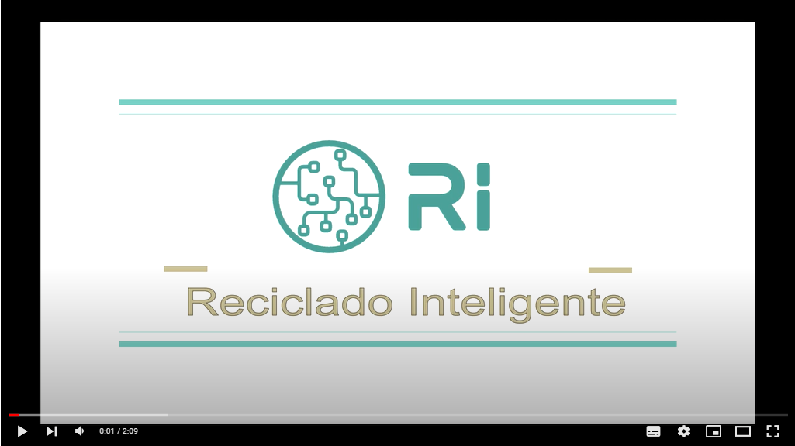

<div align="center"> <h1> Intelligent Recycling </h1> </divs>


<div align="Left">

## About the project

The enviroment pollution is one of the biggest problem of the humanity nowadays, so we decide to make a project that will deal with this problem which is Intelligent Recycling.

The main idea of our project is to create a web where you can take a photo and the web will recognize the waste which the photo shows and tell you what wastes it is and which bin it should be threw.

## Objective

There that there are always people who throws the wastes in the wrong trash bin, so that's our objective is to make people recognize easily what is the type of wastes that they are throwing.

</divs>

## Usage

Download the Python 3 and Run the following in the terminal to install the required python packages

```
python3 pip install --no-cache-dir -r requirements.txt
```

Download the source code from the repository and run in the terminal the file.

```
flask app run
```

Then you can identify wastes through our website

## Video

[](https://www.youtube.com/watch?v=6UeTWyYHZlQ)

> Click ↑:

## Example

### Cover:


---

### Example 1: (plastic)

## 

### Example 2: (Organic)

### 

### Description of bin


---

## Contributors

Authors: [@ChenghengLi](https://github.com/ChenghengLi), [@Junjie_Li](https://github.com/junjielyu13), [@Zhipeng139](https://github.com/Zhipeng139), [@ZhehanX](https://github.com/ZhehanX), [@xuyaooo](https://github.com/xuyaooo), [@BlueJK](https://github.com/BlueJK)

## License

Apache-2.0 ©ALL CONTRIBUTORS
